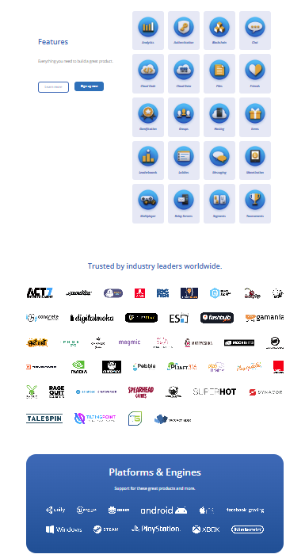
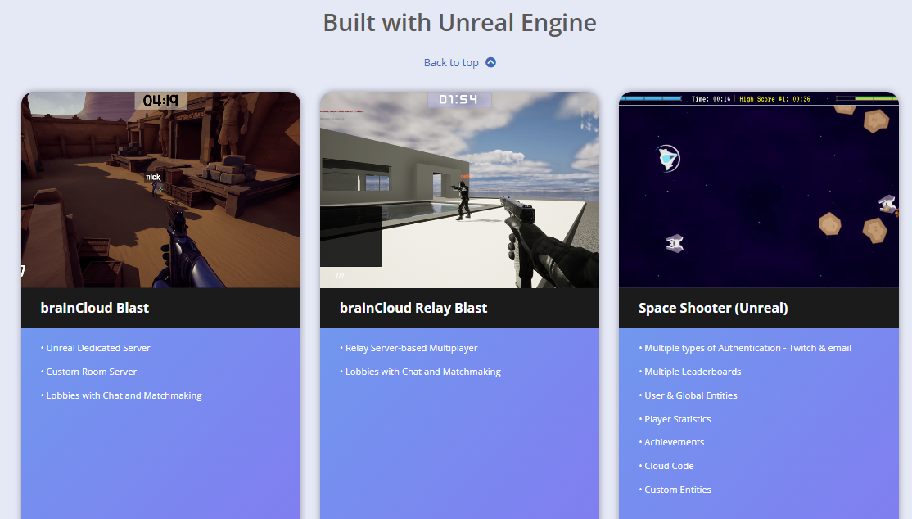
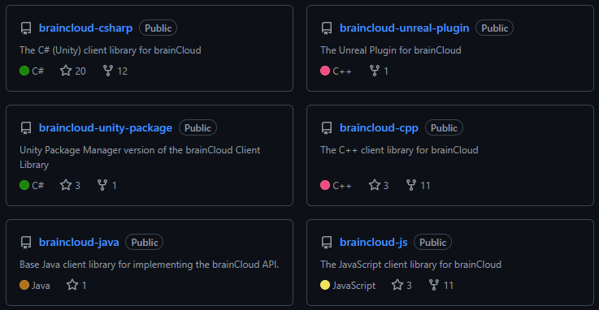
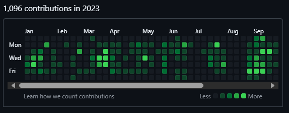

# Joanne K. Hoar

## Work Samples

### bitHeads, Inc. - Senior Software Developer
#### brainCloud BaaS https://getbraincloud.com/
This is the product I worked on, in particular the Client API for the features/service offered. Refer to Showcase > Demos to see and play the live demo games I helped build, maintain and deploy. Refer to Showcase > Games to see some of the client products that use brainCloud.

| Features | Demos |
| ---: | :--- |
|  |  |

#### brainCloud API Source Code https://github.com/getbraincloud

All of my public source code and a history of my contributions, in particular I owned C++ and Objective-C (Swift) libraries and examples and worked extensively on the Unreal Engine library and examples as well. I performed code reviews and quick fixes for all supported platforms/languages.

#### jo-codegirl - Overview https://github.com/jo-codegirl
My GitHub user profile while working on brainCloud.

## Silicon Hanna Inc. - Co-founder / Lead Developer
### Silicon Hanna - YouTube
Our games in action: promo videos and demonstrations. In particular, check out my work in Augmented Reality. My partner, Ricardo, also demonstrates our games for which he did much of the concept and level design. I worked on much of the implementation details and tech stack research.
https://www.youtube.com/channel/UCt00tah-1SQtDgIPpCNTYZw
### Homegrown Business: Joanne Hoar of Silicon Hanna Inc.
Press release for our UE4 first-person (er, bull) game.
https://calgaryguardian.com/calgary-business-silicon-hanna-inc/

## Fekete Associates Inc. (S&P Global) - Tools Programmer
### Sharing insights elevates their impact
This is one of several software projects I worked on within a suite of products. My job was to work on a team on a central in-house tools library which included GUI elements, 2D visualizations with interactive features and math calculations. I interfaced a lot with the various teams to ensure consistency and feature completeness.
https://www.spglobal.com/commodityinsights/en/ci/products/harmony-enterprise.html

## BJ Pipeline Inspection Services (Baker Hughes) - Intermediate Software Developer
### We are Process & Pipeline Services
Information to explain what is in-line pipeline inspection service. The products I worked on are Vectra and Gemini as well as an in-house reporting system.
https://www.bakerhughes.com/process-pipeline-services

## University of Calgary - Researcher / Student
### MSc. Thesis: Agent-based development of natural transportation networks
This is work of which I am very proud: my Master's of Science thesis.
https://prism.ucalgary.ca/handle/1880/41881
### The application of artificial intelligence to transportation system design
Co-authored publication in XRDS: Crossroads, The ACM Magazine for Students.
https://dl.acm.org/doi/10.1145/904073.904076
### (PDF) Bacterial Chemotaxis in Silico
Co-authored conference article, recipient of Best Student Paper award.
https://www.researchgate.net/publication/236577761_Bacterial_Chemotaxis_in_Silico
### Swarm-based Traffic Simulation with Evolutionary Traffic Light Adaptation
Co-authored undergraduate publication.
https://www.actapress.com/Abstract.aspx?paperId=26033

