# Joanne K. Hoar

## Work Samples

### Robertson College - Online Technology Instructor
I am currently teaching fully online, instructor guided courses in the School of Technology with Robertson College. Subjects have included C# Programming, ASP.NET Core, front-end frameworks (React, JavaScript, Azure), object-oriented programming (Java) and data analysis (Excel). Each course runs from 2 to 6 weeks and we tackle fast-paced projects using industry tools while learning theory and best practices. I design lessons delivered at least three times per week, provide sample code and support students as they complete assignments which I thoroughly review and grade. Students obtain a diploma and/or certification at the end of their studies.

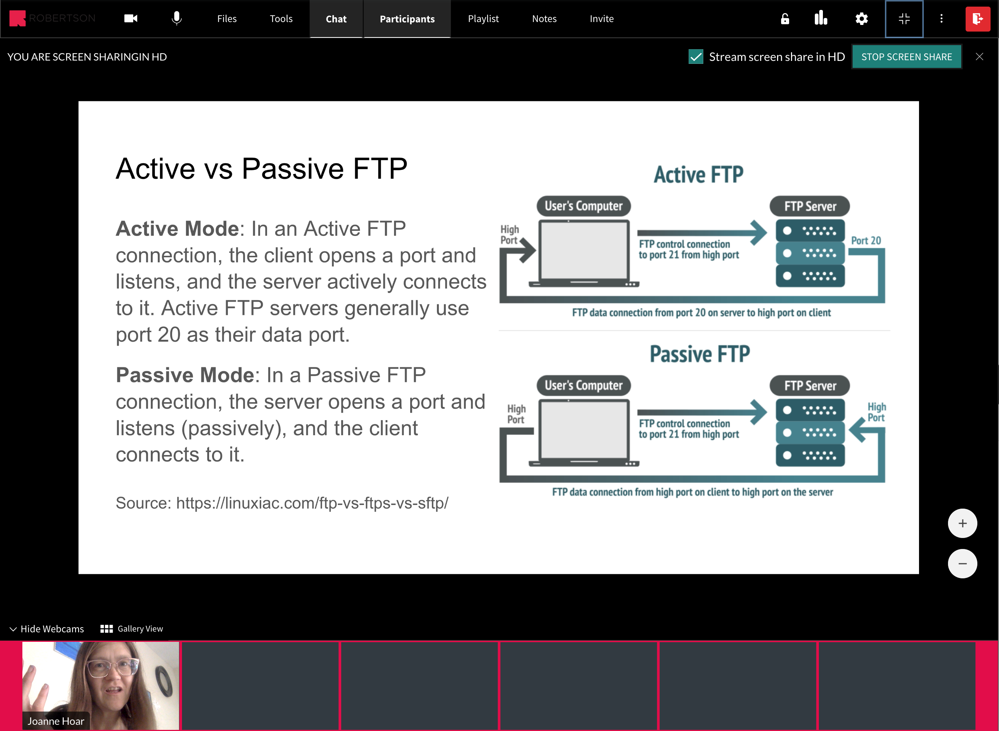

### bitHeads, Inc. - Senior Software Developer
#### brainCloud BaaS https://getbraincloud.com/
This is the product I worked on, in particular the Client API for the backend features/service offered for video games and other apps. Refer to Showcase > Demos to see and play the live demo games I helped build, maintain and deploy. Refer to Showcase > Games to see some of the client products that use brainCloud. I focused on C++, mobile and console dev and Unreal Engine. I debugged and code reviewed for all supported platforms/languages.

| Features | Demos |
| ---: | :--- |
| 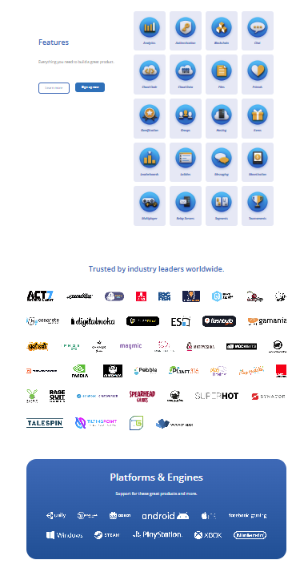 | 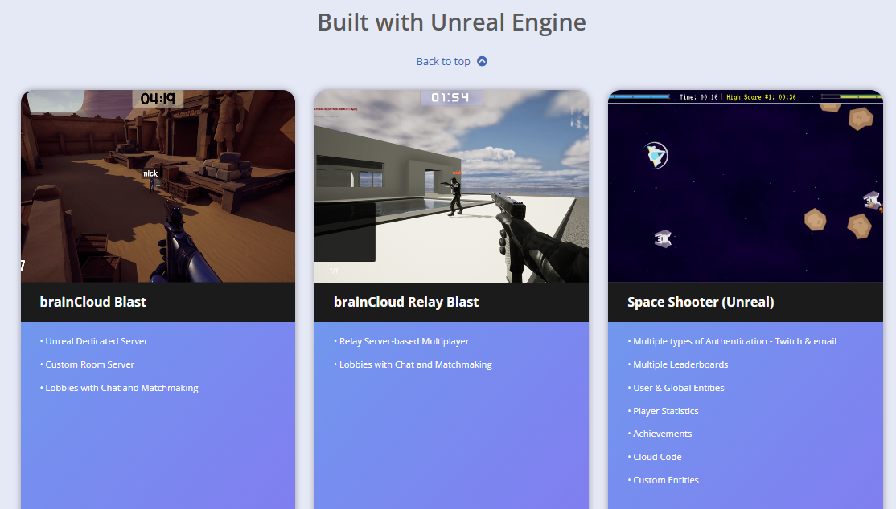 |

#### brainCloud API Source Code https://github.com/getbraincloud

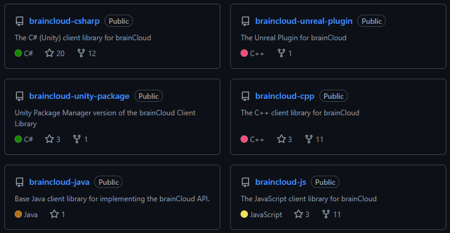

#### jo-codegirl - Overview https://github.com/jo-codegirl

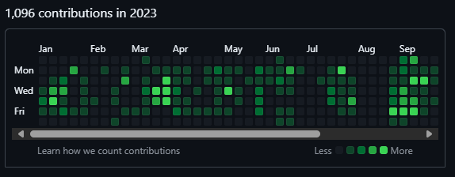

## Silicon Hanna Inc. - Co-founder / Lead Developer
### Silicon Hanna - YouTube https://www.youtube.com/channel/UCt00tah-1SQtDgIPpCNTYZw
Our games in action: promo videos and demonstrations of the iOS and Android games we made and released. Check out my work in Augmented Reality for iOS. My partner, Ricardo, also demonstrates our games for which he did much of the concept and level design. I worked on much of the implementation details and tech stack research. Earlier games were 2D physics built with OpenGL and Chipmunk.

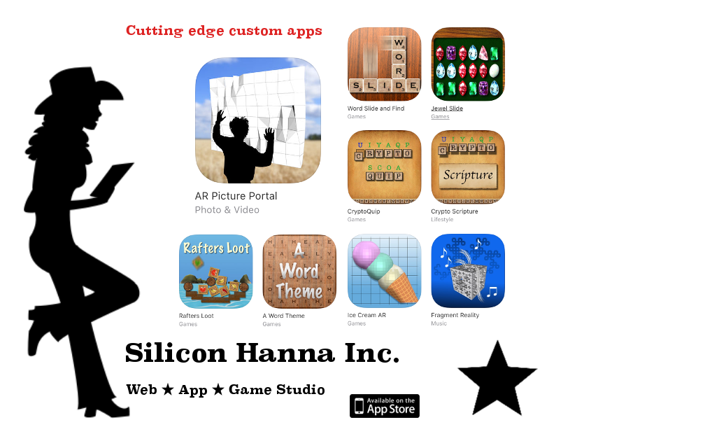

### Homegrown Business: Joanne Hoar of Silicon Hanna Inc. https://calgaryguardian.com/calgary-business-silicon-hanna-inc/
Local press on our UE4 first-person (er, bull) game.

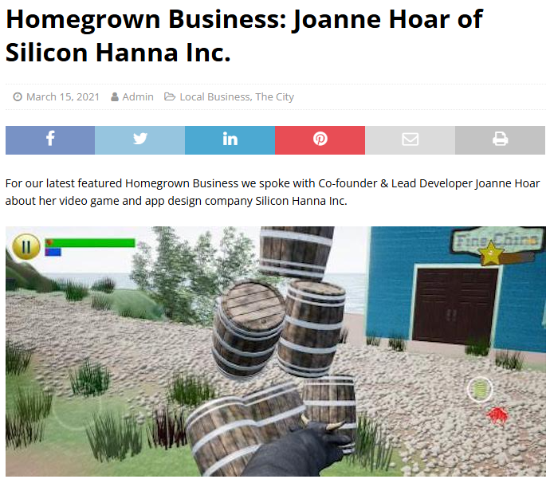

## Fekete Associates Inc. (S&P Global) - Tools Programmer
### Sharing insights elevates their impact https://www.spglobal.com/commodityinsights/en/ci/products/harmony-enterprise.html
This is one of several software projects I worked on within a suite of products. My job was to work on a team on a central in-house tools library which included GUI elements, 2D visualizations with interactive features and math calculations. I interfaced a lot with the various teams to ensure consistency and feature completeness.

| Brochure | Product |
| ---: | :--- |
| 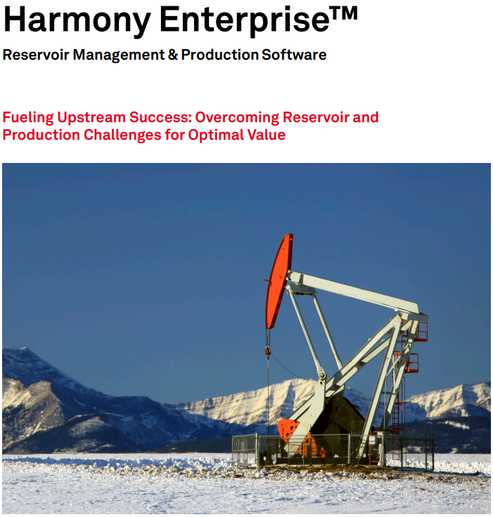 | 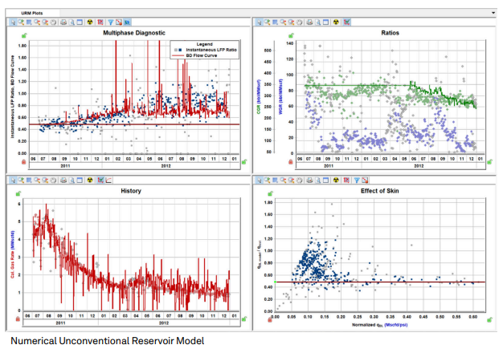 |

## BJ Pipeline Inspection Services (Baker Hughes) - Intermediate Software Developer
### We are Process & Pipeline Services https://www.bakerhughes.com/process-pipeline-services
Information about in-line pipeline inspection service. I worked on Vectra and Gemini 3D graphics and AI products used by pipeline analysts and engineers to interpret device inspection data, as well as on optimizing a C++ program to preprocess the data. I also setup and created an interactive in-house reporting system via php and javascript on a LAMP server, providing on-demand custom reports, charts and maps for corrosions and anomalies.

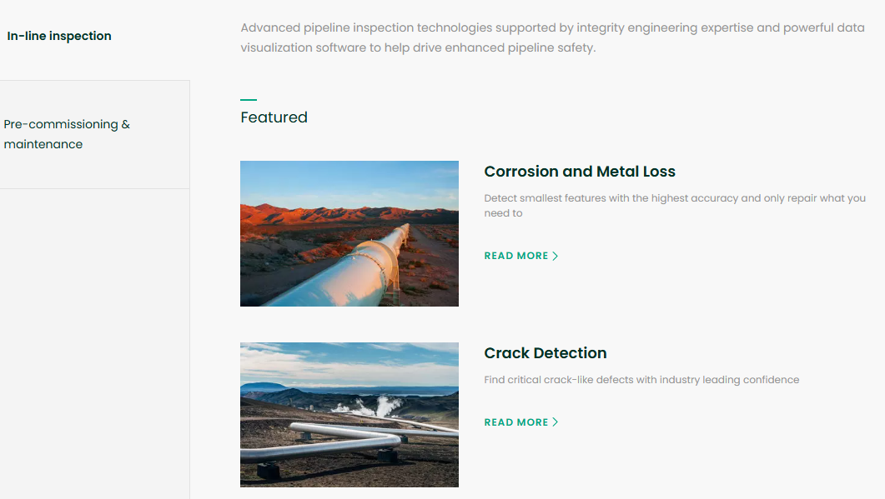

## University of Calgary - Researcher / Student
### MSc. Thesis: Agent-based development of natural transportation networks https://prism.ucalgary.ca/handle/1880/41881
This is work of which I am very proud: my Master's of Science thesis.

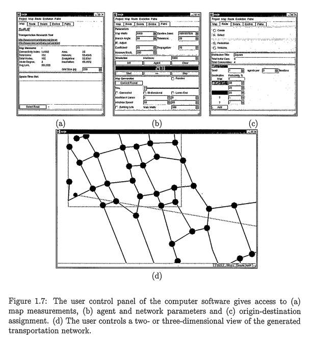

### The application of artificial intelligence to transportation system design https://dl.acm.org/doi/10.1145/904073.904076
Co-authored publication in XRDS: Crossroads, The ACM Magazine for Students.

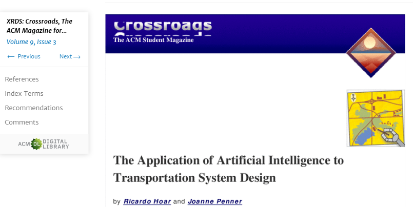

### (PDF) Bacterial Chemotaxis in Silico https://www.researchgate.net/publication/236577761_Bacterial_Chemotaxis_in_Silico
Co-authored conference article, recipient of Best Student Paper award.

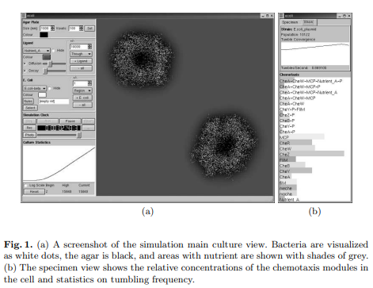

## Awards
* Departmental Nomination: Governor General's Gold Medal, Faculty of Graduate Studies, 2005
* Postgraduate Scholarship NSERC D3, Natural Sciences and Engineering Research Council of Canada, 2005
* Graduate Student Scholarship, Alberta Learning, 2004
* Best Student Paper Award, ACAL 2003
* CPSC Departmental Research Award, University of Calgary, 2003

## Community Outreach
* Vice President, Hanna Figure Skating Club, present
* Costume Coordinator, Stage Hanna Junior, 2024
* Women of bitHeads and Cookbook Committee Member, bitHeads, 2024 
* Team Manager/Assistant Coach, U11 Soccer, 2024
* Dryland Training Coordinator, Hanna Figure Skating Club, 2022 - 2024
* 4-H Public Speaking Judge, District Level Competition, 2022
* Computer Programming for Kids, J.C. Charyk School, 2019 - 2021
* Reading Program, Our Lady of Fatima School, 2016 - 2018
* Preschool Gym Leader, YMCA,  2013 - 2014
* OpenGL Elective Instructor, Fekete Associates, 2010
* Ladies Luncheon Club and Golf Tournament Coordinator, BJ Pipeline Inspection Services, 2006 - 2008 
* SCIberMENTOR Correspondant / Mentor, 2002 - 2005
* President, Computer Science Graduate Society, 2002 - 2003
* VP Academic, Computer Science Undergraduate Society, 2001 - 2001
